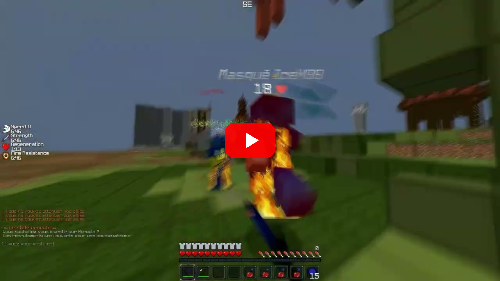
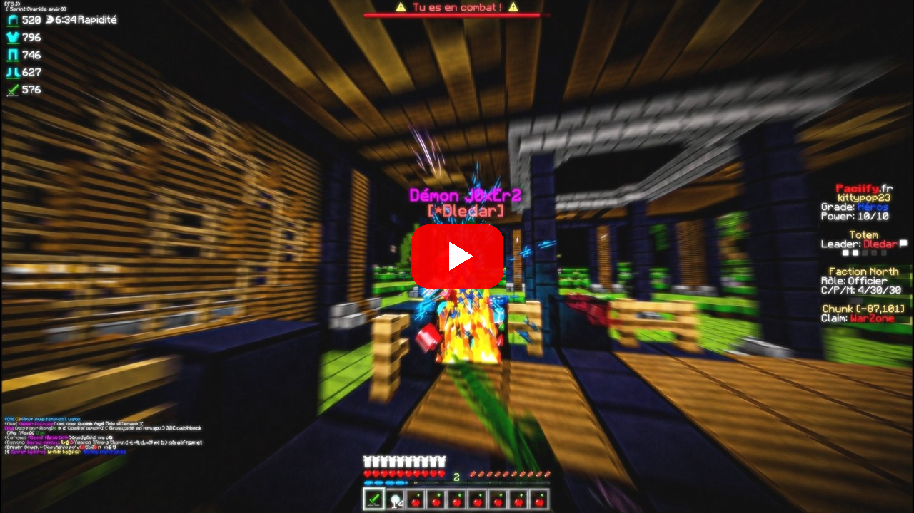
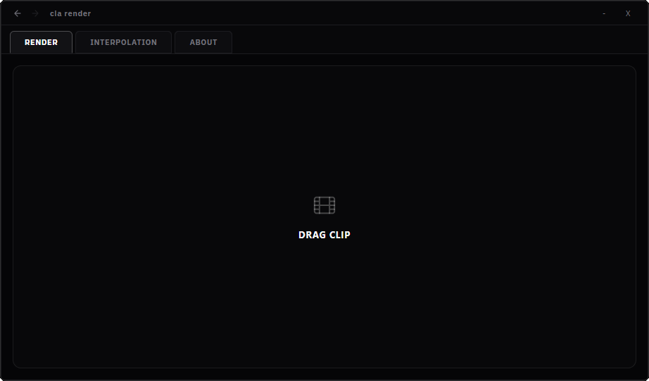

# cia render

cia render is a local Windows desktop app for two video operations:

- **RENDER** - smoothie-rs frame blending and render finishing.
- **INTERPOLATION** - optional RIFE frame multiplication.

Your media stays on the computer. cia render does not upload source videos or
silently fetch render engines.

## Render Preview

<table>
  <tr>
    <td align="center" width="50%">
      <a href="https://www.youtube.com/watch?v=8plMwxkAvlA">
        
      </a>
    </td>
    <td align="center" width="50%">
      <a href="https://www.youtube.com/watch?v=bR7FxKNNV0Y">
        
      </a>
    </td>
  </tr>
</table>

---

## UX



## Getting started

Download the latest Windows installer from the
[releases page](https://github.com/cia213/cia-app/releases). Installing and
launching the app is enough to start using **RENDER** - no setup wizard, no
extra downloads.

**INTERPOLATION** is optional and downloads a separate RIFE environment on
first use. It requires a CUDA-capable NVIDIA GPU. See
[Install and first launch](docs/INSTALL.md) for details.

## Build from source

Prerequisites: current Node.js, Rust stable, and Windows build tools.

```powershell
npm ci
npm run tauri dev
```

Create an NSIS installer:

```powershell
npm run tauri build
```

The release build also needs the ignored release payload described in
[runtime release notes](docs/RUNTIME-RELEASE-NOTES.md) before it can be
redistributed.

## Licence and notices

cia render source code is MIT licensed. Third-party software keeps its own
licence; see [THIRD_PARTY_NOTICES.md](THIRD_PARTY_NOTICES.md). Nothing in this
repository grants redistribution rights for an external runtime or model.
