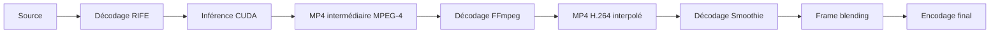

# Audit qualité et performances de cia render

**Date : 30 septembre 2026 · version 1.2.3 · commit audité : `241f350`.**

> Audit historique du code **avant correction**. Les constats, numéros de ligne et mesures ci-dessous décrivent cette révision, pas le patch actuel. Le bilan des corrections et leurs validations est dans [PATCH-QUALITE-PERFORMANCES.md](PATCH-QUALITE-PERFORMANCES.md). Les microbenchmarks de cet audit ne sont pas des gains mesurés sur l'application corrigée.

Périmètre : sources Svelte/Tauri, script Python embarqué, script autonome de `time-remap-app`, moteur RIFE local et runtime Smoothie local. Les ressources binaires ignorées par Git sont évaluées comme composants de l'installation locale, sans supposer qu'une autre release contient exactement les mêmes fichiers.

## Conclusion

Les parcours nominaux fonctionnent dans les essais réalisés : le frontend compile, les sept tests Rust passent et les moteurs RIFE/Smoothie produisent des vidéos dans les benchmarks. Les contrôles de noms de sortie, la configuration versionnée, le streaming des logs et la séparation des runtimes sont de bonnes bases.

Les priorités sont cependant la **propriété des jobs et des fichiers temporaires**, puis la **fidélité entre les paramètres affichés et ceux réellement appliqués**. Les principaux gains de performance se trouvent dans les passes vidéo répétées et les choix de moteur/encodeur, davantage que dans la taille du frontend.

Le lien entre les deux audits est direct : une chaîne mieux définie évite les traitements concurrents accidentels, les décodages inutiles, les intermédiaires non maîtrisés et les reprises complètes après erreur.

## Vérifications et méthode

| Vérification | Résultat |
| --- | --- |
| `npm run build` | Réussi ; JS produit ≈ 126,79 kB, gzip ≈ 39,67 kB |
| `cargo test --manifest-path src-tauri/Cargo.toml` | 7 tests réussis, aucun échec |
| `cargo clippy --manifest-path src-tauri/Cargo.toml --all-targets -- -D warnings` | Échec : 3 diagnostics, décrits plus bas |
| Syntaxe des deux scripts Python par `ast.parse` | Valide |
| NVIDIA / PyTorch | RTX 3050 Laptop, 4 Gio VRAM ; PyTorch 2.5.1+cu121 ; CUDA disponible |
| Modèle RIFE local | SHA-256 identique au hash 4.26 attendu par le bootstrap |
| Benchmarks | Deux exécutions par variante RIFE ; trois par variante aperçus/FFmpeg ; mesures Smoothie complémentaires |

Source de performance : `test_clip_topaz_source_2s.mp4`, 1680 × 1050, 120 FPS, 242 images et ≈ 2,017 s. Pour RIFE : extrait temporaire de 48 images, 0,4 s, même résolution, facteur ×2. Tous les résultats vidéo de benchmark sont créés dans des répertoires temporaires puis supprimés. Les sources et le code de production restent inchangés.

Les temps incluent démarrage de processus, chargement du modèle et écriture. Ce sont des **microbenchmarks locaux**, avec caches et ordre d'exécution non randomisé ; ils ne mesurent pas un débit stabilisé sur une longue vidéo. Pas de mesure visuelle comparative FP16/FP32, pas de mesure de pic RAM/VRAM et pas de benchmark 4K/HDR/VFR complet. Les pourcentages ne s'additionnent pas entre étapes.

Les données brutes sont dans [AUDIT-MESURES.json](AUDIT-MESURES.json) et [AUDIT-PREUVES.json](AUDIT-PREUVES.json). Les scripts de reproduction sont `C:/Users/cia/time-remap-app/audit_quality_performance.py` et `audit_quality_checks.py` ; lancer ces scripts avec le Python du venv local. Le second script complète les mesures Smoothie avec filtres identiques.

## Audit qualité — problèmes prioritaires

Priorités : **P1** = correction prioritaire, risque de données/résultat ou de perte du suivi du traitement ; **P2** = fiabilité fonctionnelle et maîtrise des ressources ; **P3** = maintenance et optimisation secondaire. « Reproduit » désigne un contrôle exécuté ; « lecture » désigne un chemin confirmé dans le code dont le scénario complet n'a pas été exécuté.

### Q1 — P1 : l'historique peut faire disparaître un job actif

**Source :** [App.svelte, `applyHistoryEntry`](https://github.com/cia213/cia-app/blob/241f350025e7e8504d0f5eae1f3c46ea283778cd/src/App.svelte#L232), boutons d'historique autour de L1248, et `anyProcessing` L335. **Preuve : reproduit en exécutant la fonction extraite avec Node.**

Si un rendu est actif et l'utilisateur revient à une entrée sans vidéo sélectionnée, `applyHistoryEntry` met `isSmoothieProcessing` ou `isProcessing` à `false`. Aucun arrêt du processus n'est demandé. Les boutons d'historique et les raccourcis Alt+flèches restent utilisables pendant le rendu. `anyProcessing` devient faux et peut autoriser un autre traitement alors que le premier continue. Les logs et `activeRenderJobId` sont partagés, ce qui compromet ensuite le suivi et l'annulation.

**Correction :** séparer l'état de navigation de l'état des jobs ; garder le job actif dans un store dédié, attaché à une entrée immuable (source, paramètres, destination). Ajouter une garde backend globale si un seul traitement est autorisé. Une navigation peut changer la page sans modifier l'existence du job.

**Vérification :** démarrer un traitement A, naviguer en arrière, tenter B, puis annuler A ; A doit rester visible et contrôlable, et B respecter la politique de concurrence.

### Q2 — P1 : l'intermédiaire RIFE peut écraser puis supprimer un fichier préexistant

**Sources :** [script embarqué L134](https://github.com/cia213/cia-app/blob/241f350025e7e8504d0f5eae1f3c46ea283778cd/src-tauri/resources/time_remap.py#L134), recherche L181 et suppression L289 ; `Practical-RIFE/inference_video.py` L134–138. **Preuve : lecture du chemin complet, sans essai destructif.**

Rust réserve la destination finale, mais le script ne transmet pas `--output` à RIFE. RIFE ouvre son nom par défaut, dérivé de la source, avec `cv2.VideoWriter`. Si `clip_2X_240fps.mp4` existe déjà, cette ouverture peut l'écraser. Après encodage, le script supprime ce même fichier. Le verrou sur `clip-240fps.mp4` ne le protège pas.

**Correction :** un répertoire temporaire unique par job, un chemin intermédiaire explicite passé à `--output`, et un nettoyage limité aux fichiers possédés par ce job. Supprimer la découverte par glob/date de modification. Garder un résultat validé si l'étape suivante échoue.

**Vérification :** précréer le nom RIFE historique avec un contenu connu ; son hash doit rester intact après succès, échec et annulation.

### Q3 — P1 : cycle de vie des processus incomplet

**Sources :** [lib.rs L1600](https://github.com/cia213/cia-app/blob/241f350025e7e8504d0f5eae1f3c46ea283778cd/src-tauri/src/lib.rs#L1600), L1688 et [bouton fermer L1279](https://github.com/cia213/cia-app/blob/241f350025e7e8504d0f5eae1f3c46ea283778cd/src/App.svelte#L1279). **Preuve : lecture.**

Les moteurs sont lancés avant `register_job`. Un identifiant vide/déjà utilisé fait donc échouer l'enregistrement après le démarrage. Les sorties anticipées par `?` ne garantissent pas l'arrêt du processus ni le retrait du registre. Aucun traitement de fermeture de fenêtre/arrêt de l'application ni propriétaire Windows de l'arbre de processus n'est défini. Des enfants peuvent continuer, ou rester suspendus après fermeture.

**Correction :** réserver le job avant le spawn ; centraliser le lancement dans un gestionnaire avec finalisation garantie. Sous Windows, envisager un Job Object pour posséder l'arbre et terminer les descendants à la fermeture. `kill_on_drop` peut compléter la protection du parent, mais ne suffit pas à garantir l'arrêt de tout l'arbre.

**Vérification :** rejet d'identifiant, erreur de lecture, fermeture pendant calcul et fermeture pendant pause ; aucun moteur ni verrou ne doit rester orphelin.

### Q4 — P1 sur le runtime local : la recette Smoothie déforme certains ratios

**Source :** `src-tauri/resources/runtime/smoothie/recipe.ini`, L25. **Preuve : expression lue ; dimensions vérifiées dans les mesures Smoothie avec filtres identiques.**

La largeur et la hauteur sont arrondies indépendamment vers des paliers, puis `setsar=1/1` est appliqué. Ainsi, 1680 × 1050 (16:10) devient 1920 × 1080 (16:9). Ce traitement augmente aussi le nombre de pixels à encoder. Les vidéos verticales ou hors 16:9 peuvent également changer de proportions.

**Correction :** conserver les dimensions par défaut ; proposer une résolution explicite avec ratio conservé, dimensions paires et padding éventuel. Auditer aussi `defaults.ini`, qui contient des arguments de secours différents, dont un filtre audio `rubberband=tempo=1.07`.

**Vérification :** sources 16:10, 4:3, 16:9 et verticales ; comparer ratio d'affichage, durée audio et dimensions finales. Ce constat porte sur le runtime local ignoré par Git, pas sur toutes les releases publiées.

### Q5 — P2 : réglages visibles mais non appliqués

**Sources :** [overrides Svelte L1017](https://github.com/cia213/cia-app/blob/241f350025e7e8504d0f5eae1f3c46ea283778cd/src/App.svelte#L1017), [runtime Smoothie L786](https://github.com/cia213/cia-app/blob/241f350025e7e8504d0f5eae1f3c46ea283778cd/src-tauri/src/lib.rs#L786), [lancement Smoothie L1650](https://github.com/cia213/cia-app/blob/241f350025e7e8504d0f5eae1f3c46ea283778cd/src-tauri/src/lib.rs#L1650), [runtime RIFE L763](https://github.com/cia213/cia-app/blob/241f350025e7e8504d0f5eae1f3c46ea283778cd/src-tauri/src/lib.rs#L763), script Python L129–136.

| Réglage | Comportement observé | Correction |
| --- | --- | --- |
| `sceneThreshold` / `blendCuts` | Le premier change le décompte, le second est affiché ; les timestamps ne pilotent pas RIFE et aucun fondu n'est appliqué | Implémenter le comportement et ses tests ou retirer/désactiver le réglage |
| Correction couleur | Luminosité/saturation/contraste sont transmis, mais aucun override `color grading;enabled;yes` ; la recette locale désactive cette section | Définir activation et paramètres ensemble |
| Recette choisie | Le chemin est sauvegardé/affiché mais non passé avec `--recipe` à smoothie-rs | Ajouter le chemin effectif à `SmoothieRuntimePaths` et à la commande |
| LUT choisie | `lutFile` est stocké, mais son chemin ne figure pas dans la commande de rendu | Transmettre le chemin avec une validation réelle |
| Modèle RIFE choisi | `modelFile` est validé, mais aucun `--model` n'est transmis ; l'inférence importe en plus le code de `train_log` | Définir une installation modèle cohérente code + poids, puis utiliser ce chemin |

Le moteur Smoothie expose bien `--recipe` dans son aide. Les réglages couleur et la recette effective sont contrôlés via `--return-recipe` dans les preuves complémentaires. Une validation de chemin seule ne signifie pas qu'un réglage est utilisé.

### Q6 — P2 : validation d'entrée et cadence trop permissives

**Sources :** [lib.rs L924](https://github.com/cia213/cia-app/blob/241f350025e7e8504d0f5eae1f3c46ea283778cd/src-tauri/src/lib.rs#L924), L1221, [Python L96](https://github.com/cia213/cia-app/blob/241f350025e7e8504d0f5eae1f3c46ea283778cd/src-tauri/resources/time_remap.py#L96), et `inference_video.py` L68. **Preuve : lecture.**

Rust accepte tout facteur fini positif ; le CLI RIFE exige un entier et l'UI prévoit 2 à 10. CRF, preset et seuil ne sont pas validés par une structure commune. Les préférences sont des objets JSON libres. FFprobe peut être interprété comme une vidéo de dimensions/durée nulles plutôt que rejeté. La cadence utilise `r_frame_rate` puis des arrondis, alors que RIFE lit les FPS avec OpenCV ; le repérage récent du fichier résout le nom, sans définir une politique VFR ni garantir une cadence rationnelle fidèle.

**Correction :** modèles typés et validation backend avant lancement ; FPS rationnels, durée/stream valides ; politique explicite pour VFR (préserver les timestamps ou normaliser une seule fois). Accepter un entier ×2…×10 tant que c'est le contrat réel.

**Vérification :** paramètres hors bornes, 23,976/29,97 FPS, cadence variable, fichier audio seul et source illisible. Comparer durée, timestamps et nombre de frames.

### Q7 — P2 : un fichier non vide est considéré comme un résultat valide

**Sources :** [lib.rs L1262](https://github.com/cia213/cia-app/blob/241f350025e7e8504d0f5eae1f3c46ea283778cd/src-tauri/src/lib.rs#L1262) ; RIFE `build_read_buffer` L152–162 et finalisation L275–279. **Preuve : lecture ; résultat nominal mesuré.**

Le lecteur RIFE masque toute exception avec `except: pass`, ce qui peut transformer une erreur de décodage en fin de vidéo. La finalisation attend que la queue soit vide, sans joindre le thread d'écriture ; une queue vide ne garantit pas que le dernier `write` soit fini avant `release`. Rust vérifie seulement existence et taille du fichier. Une sortie tronquée peut donc être déclarée terminée.

**Correction :** propager les erreurs des workers, joindre explicitement le writer, vérifier l'ouverture du `VideoWriter`, puis contrôler durée, cadence, frames attendues et streams par FFprobe. Réserver un décodage exhaustif aux tests de référence ou à un mode de validation approfondie.

Les benchmarks RIFE donnent 95 images pour 48 entrées ×2, soit `(48−1)×2+1`, et non 96. Ce comportement explique 0,395833 s au lieu de 0,4 s ; il faut décider et tester la politique du dernier intervalle plutôt que marquer cette différence comme une corruption.

### Q8 — P2 : erreurs de chargement et tâches d'aperçu obsolètes

**Sources :** [loadVideo L821](https://github.com/cia213/cia-app/blob/241f350025e7e8504d0f5eae1f3c46ea283778cd/src/App.svelte#L821), [loadSmoothie L985](https://github.com/cia213/cia-app/blob/241f350025e7e8504d0f5eae1f3c46ea283778cd/src/App.svelte#L985), chargement des aperçus L461–502. **Preuve : lecture.**

Les images sont protégées par des identifiants de requête, mais les réponses `analyze_video` ne le sont pas. Importer A puis B rapidement peut laisser les métadonnées de A avec le chemin B, ou une erreur tardive de A effacer B. Un ancien scan d'aperçus continue par ailleurs à lancer ses processus FFmpeg même lorsque son résultat sera rejeté.

**Correction :** identifiant de sélection pour analyse et aperçu ; annulation des processus obsolètes côté Rust ; différer les aperçus facultatifs lorsqu'un moteur travaille. Le traitement doit conserver une copie immuable de ses paramètres, y compris l'option auto-render.

### Q9 — P2 : configuration et messages de sauvegarde fragiles

**Sources :** [lib.rs L448](https://github.com/cia213/cia-app/blob/241f350025e7e8504d0f5eae1f3c46ea283778cd/src-tauri/src/lib.rs#L448), L1339 ; [App.svelte L93](https://github.com/cia213/cia-app/blob/241f350025e7e8504d0f5eae1f3c46ea283778cd/src/App.svelte#L93), L157 et L324. **Preuve : lecture.**

`save_ui_preferences` repart d'une configuration vide si le chargement échoue, puis écrit cette configuration : un fichier invalide ou momentanément inaccessible peut faire perdre les chemins existants. Le fichier temporaire porte seulement le PID ; des écritures concurrentes, notamment depuis l'installation asynchrone, ne sont pas coordonnées. Côté UI, `persistUiPreferences` absorbe l'erreur et le caller affiche ensuite « settings saved ».

**Correction :** ne pas écraser une configuration qui n'a pas pu être lue ; gérer explicitement réparation/migration. Sérialiser les mises à jour avec un verrou, utiliser un temporaire unique, puis propager succès/échec jusqu'au message utilisateur.

### Q10 — P2 : noms spéciaux, sous-titres et couleurs non couverts

**Sources :** [glob Python L182](https://github.com/cia213/cia-app/blob/241f350025e7e8504d0f5eae1f3c46ea283778cd/src-tauri/resources/time_remap.py#L182), mapping des sous-titres L215, encodeur L218. **Preuve : nom avec crochets reproduit ; autres cas par lecture.**

- `clip [v1]` est traité comme un motif glob. La reproduction montre un fichier existant et zéro correspondance. Un chemin intermédiaire explicite résout à la fois ce défaut et Q2.
- Les sous-titres sont copiés dans un MP4 sans vérifier leur codec ; SubRip/ASS ne passent pas par une conversion adaptée. En slowmo, leurs timestamps ne sont pas étirés.
- La chaîne force `yuv420p` et des tags BT.709 sans conversion HDR ou politique 10 bits. Changer les tags ne réalise pas un tone mapping.

**Correction :** contrat d'entrée/sortie documenté, codecs compatibles, sous-titres retimés ou exclusion explicite, traitement colorimétrique cohérent avec la source. Tests dédiés avant d'annoncer un support universel.

### Q11 — P2 : l'aperçu final n'est pas extrait du résultat

**Source :** [loadOutputPreview L505](https://github.com/cia213/cia-app/blob/241f350025e7e8504d0f5eae1f3c46ea283778cd/src/App.svelte#L505), aperçu live L513. **Preuve : lecture.**

`loadOutputPreview` ignore effectivement les paramètres `path` et `duration` et réutilise l'image source/live. L'aperçu live utilise `tmix` sur la source et ne reproduit pas nécessairement la recette Smoothie, la LUT ou les corrections couleur. Le résultat peut sembler visuellement inchangé même quand le fichier réel diffère.

**Correction :** extraire une image du vrai fichier final après succès ; présenter l'aperçu de source pendant calcul comme une approximation, ou utiliser un aperçu fidèle à la recette. Éviter de rendre une vidéo complète pour produire une seule vignette.

## Maintenance et couverture — P3

- **Concentration du code :** `App.svelte` ≈ 3918 lignes, `lib.rs` ≈ 1950 lignes. Séparer jobs, configuration, outils média, aperçu, installation et updater. Garder la navigation et la présentation distinctes de l'exécution.
- **Deux scripts divergents :** partager une implémentation d'orchestration testée ; faire du script autonome un point d'entrée mince. Les correctifs du script embarqué ne sont pas présents automatiquement dans le script autonome.
- **Clippy :** fermeture immédiatement appelée (`lib.rs:264`), `repeat().take()` (`1097`), commande avec trop d'arguments (`1539`). Ce sont des diagnostics de maintenance, pas la preuve de trois erreurs de rendu.
- **Télémétrie :** `live-log` transporte du texte sans `jobId`. Les regex dépendent de la page active et du format des outils. Préférer des événements typés `{jobId, phase, frame, total, fps, elapsed, error}` et garder le texte pour le diagnostic.
- **Mémoire des logs :** Python conserve tout stderr RIFE (`all_stderr`), Rust collecte toutes les lignes (`pump_and_collect`), même si l'UI limite à 500. Garder une queue bornée et éventuellement un fichier de diagnostic par job.
- **CI/distribution :** les tests ne couvrent pas les moteurs bout à bout, le frontend ou les interruptions. Le workflow construit un installateur alors que ses payloads sont ignorés et leur préparation n'apparaît pas dans les étapes. Séparer vérification des sources et construction d'une release reproductible. Mettre à jour `PORTABILITY-PLAN.md`, devenu historique.

## Audit performances — mesures

| Variante | Temps médian local | Lecture |
| --- | ---: | --- |
| RIFE FP32, scale 1 | 14,11 s | Référence ; 48 images à 1680 × 1050, ×2 |
| RIFE FP16, scale 1 | 11,50 s | ≈ 18,5 % de temps en moins, ≈ 1,23× ; qualité non comparée |
| RIFE FP16, scale 0,5 | 10,38 s | ≈ 26,4 % de temps en moins que FP32 ; modifie le calcul, qualité non comparée |
| Aperçus : 8 scans gris + 8 PNG | 5,48 s | Couverture initiale exclue |
| Aperçus : 8 PNG seulement | 2,67 s | ≈ 51,3 % en moins ; calcul local de luminance à rajouter |
| Détection de scènes sur la source 2 s | 0,502 s | Passe complète actuellement non utilisée pour le calcul RIFE |
| FFmpeg x264 medium, CRF 18 | 5,03 s | Vidéo seule, source 120 FPS ; fichier ≈ 11,89 Mo |
| FFmpeg x264 fast, CRF 18 | 4,12 s | ≈ 18,1 % en moins ; fichier ≈ 12,19 Mo |
| FFmpeg NVENC p5, CQ 18 | 1,20 s | ≈ 76,1 % en moins ; fichier ≈ 22,93 Mo ; qualité non équivalente au CRF 18 |
| Smoothie x264, filtres de référence | 2,98 s | Blending 30 FPS, intensité 1, audio AAC et scale de la recette |
| Smoothie NVENC, mêmes filtres/audio | 1,98 s | ≈ 33,6 % en moins ; qualité visuelle non comparée |

Les premières mesures `smoothie_baseline`/`smoothie_nvenc` du JSON principal n'utilisent pas la même mise à l'échelle : **elles sont exclues de la comparaison de vitesse**. Les mesures `*_matched` de `AUDIT-PREUVES.json` conservent les mêmes filtres et paramètres audio ; seul l'encodeur change. Les chiffres et limites de cette comparaison sont ajoutés dans la section complémentaire ci-dessous.

## Optimisations recommandées, reliées aux défauts qualité

### F1 — Priorité haute, effort faible : supprimer la passe scène inutilisée

Le scan de scène décode toute la vidéo avant de démarrer RIFE et stocke les logs en mémoire. Les timestamps ne sont pas utilisés. Le moteur RIFE possède déjà une logique de similarité/coupure interne, indépendante du seuil affiché.

Retirer cette passe tant que les options ne sont pas implémentées, ou intégrer le besoin au décodage/inférence existant. Cela réduit le temps avant la première image sans modifier le calcul RIFE actuellement effectué. Pour ce clip : ≈ 0,5 s par job. Le chronomètre Python démarre **après** ce scan ; le temps annoncé omet donc son coût.

### F2 — Priorité haute, effort moyen : décoder chaque aperçu une seule fois

L'import actuel peut lancer 1 FFmpeg pour la couverture, 8 pour la luminance et 8 pour les PNG. Calculer la luminance à partir de l'image déjà extraite réduit les recherches et démarrages. Mettre en cache les résultats (chemin canonique + taille + modification + options), réutiliser les images identiques et annuler les anciennes sélections.

Le prototype de mesure passe de 5,48 à 2,67 s pour les 16→8 appels, sans encore chiffrer le calcul gris local. La priorité de rendu doit passer avant les aperçus facultatifs. Limiter la concurrence FFmpeg : lancer tous les scans en parallèle peut augmenter RAM et contention disque/CPU.

### F3 — Priorité haute, effort moyen : ajouter un profil FP16 validé

RIFE expose `--fp16`, mais l'application ne le transmet pas. Sur la RTX 3050 testée, la variante FP16 garde les mêmes dimensions et le même nombre d'images et réduit le temps de 18,5 %. Proposer FP32/FP16 ou un choix automatique testé, avec fallback et validation de compatibilité.

Ne pas promettre une identité visuelle : évaluer les mouvements rapides, textures fines, contours, occlusions et fondus. `scale=0.5` conserve les dimensions finales mais change l'estimation du mouvement ; en faire un profil distinct, pas un réglage invisible. Le projet [Practical-RIFE](https://github.com/hzwer/Practical-RIFE/blob/main/README.md) documente l'option de scale pour les hautes résolutions.

### F4 — Priorité haute, effort moyen : rendre l'encodeur configurable

RIFE impose `libx264` ; la recette Smoothie locale aussi. Proposer un profil CPU et un profil NVENC, avec contrôle de disponibilité, paramètres spécifiques et fallback explicite. Mesurer temps, bitrate et qualité à objectifs comparables : CRF 18 et CQ 18 n'ont pas la même signification.

La réduction mesurée concerne l'encodage, pas toute l'interpolation. Un gain GPU d'encodage peut aussi changer la contention avec l'inférence si les étapes sont pipelinées. Le guide officiel [NVIDIA FFmpeg](https://docs.nvidia.com/video-technologies/video-codec-sdk/13.0/ffmpeg-with-nvidia-gpu/index.html) décrit les voies NVENC/NVDEC ; leur présence dans `-encoders` seule ne suffit pas, les essais d'encodage ont ici réussi.

### F5 — Priorité haute pour stabilité, effort moyen : borner les buffers RIFE par mémoire

`inference_video.py:198–199` crée deux queues de 500 images RGB. À 1920 × 1080, 1000 images représentent environ **5,8 Gio** ; à 3840 × 2160, environ **23,2 Gio**, hors tenseurs et autres allocations. Ce sont des plafonds théoriques si les queues se remplissent, pas des pics observés.

Dimensionner les queues selon résolution et budget mémoire, par exemple quelques images pour la 4K, puis profiler débit et RAM. Des queues plus grandes ne rendent pas automatiquement un GPU plus rapide. Conserver une petite avance de décodage/écriture pour éviter de le laisser attendre ; vérifier le débit après réduction.

### F6 — Fort potentiel, effort élevé : supprimer les encodages intermédiaires inutiles

Le fichier nommé « raw » est un MP4 MPEG-4 compressé (`mp4v`), confirmé par FFprobe. L'auto-chain ajoute un encodage H.264 puis un nouveau décodage avant Smoothie. Cela consomme CPU/disque et applique plusieurs compressions avec perte.

Étape pragmatique : conserver un intermédiaire unique explicitement choisi pour Smoothie et ne pas produire un H.264 de livraison dont on n'a pas besoin. Garder un mode qui conserve un résultat RIFE exploitable en cas d'échec Smoothie.

Étape plus ambitieuse : transmettre les frames à l'encodeur final ou à un moteur de blending via pipe, ou intégrer RIFE à une chaîne VapourSynth compatible. Un pipe RGB brut en 1080p240 représente environ **1,49 Go/s** (≈ 5,97 Go/s en 4K240) ; supprimer un MP4 sans maîtriser les copies peut déplacer le goulot plutôt que l'éliminer. Prévoir backpressure, annulation, formats couleur et synchronisation audio. Aucun gain chiffré n'est revendiqué avant prototype.

### F7 — Priorité moyenne : limiter les copies et synchronisations GPU

Chaque image fait un transfert CPU→GPU, puis chaque résultat revient via `.cpu().numpy()`. Les tests SSIM dans des conditions Python et ces retours peuvent introduire des points de synchronisation. Profiler avant modification ; essayer buffers réutilisés, transfert par groupes et streams CUDA lorsque cela conserve les dépendances temporelles.

`non_blocking=True` est déjà présent, mais ne prouve pas un chevauchement effectif. Le guide [PyTorch sur les transferts](https://docs.pytorch.org/tutorials/intermediate/pinmem_nonblock.html) expose les conditions et les coûts possibles de la mémoire épinglée ; éviter de rajouter `pin_memory()` à chaque frame sans mesurer.

### F8 — Priorité moyenne : worker RIFE persistant et inference_mode

Lancer Python, charger les imports CUDA et le modèle à chaque fichier pénalise les clips courts. Un worker persistant pourrait amortir ces coûts, avec reset explicite de l'état entre jobs et libération du GPU au repos. Le mesurer sur une série de clips, pas seulement sur une vidéo longue.

RIFE désactive déjà les gradients et active cuDNN benchmark : inutile de présenter ces options comme nouvelles optimisations. Tester `torch.inference_mode()` à la place du no-grad global dans un chemin dédié, en contrôlant compatibilité et résultat. La documentation [PyTorch inference_mode](https://docs.pytorch.org/docs/stable/generated/torch.autograd.grad_mode.inference_mode.html) décrit la suppression de coûts supplémentaires de suivi ; le gain ici n'est pas mesuré.

`torch.compile`/TensorRT restent des pistes ultérieures : coût de compilation, compatibilité du warp/modèle, formes variables, packaging Windows et bénéfice sur ce GPU doivent être démontrés. Pas de migration moteur précipitée avant d'éliminer les passes redondantes.

### F9 — Priorité basse à moyenne : réduire le travail de l'interface

`GlowSlider.svelte:47` programme des frames d'animation sans arrêt après convergence, et `appendLog` reconstruit jusqu'à 500 lignes à chaque événement. Arrêter les animations immobiles, regrouper l'affichage des logs et publier une progression typée à fréquence bornée. Ne pas tronquer les erreurs utiles.

Le JS de production est déjà raisonnable. Ces changements améliorent consommation et fluidité ; ils ont moins de chances de raccourcir fortement une inférence GPU que F1–F6.

## Ordre de mise en œuvre conseillé

| Lot | Contenu | Condition de réussite |
| --- | --- | --- |
| 1 — Fiabilité | Q1/Q2/Q3, validation d'entrée, writer joint, ownership des sorties | Navigation/fermeture/annulation sans jobs orphelins ni écrasement ; préexistants conservés |
| 2 — Fidélité | Ratio vidéo, recette/LUT/modèle effectifs, couleur et options scène cohérentes, aperçu final | Paramètres observables dans le résultat et tests sur les formats annoncés |
| 3 — Gains mesurables | F1/F2/F3/F4/F5, instrumentation par étape | Temps total et par phase comparés ; RAM/VRAM bornées ; aucune régression de contenu |
| 4 — Architecture | F6/F7/F8, stores/modules, événements typés | Gains confirmés sur corpus varié, démarrage court et longues vidéos |

Pour chaque lot : clips courts et longs, 720p/1080p/4K, différentes cadences, mouvements difficiles, audio et sous-titres, plus annulation et espace disque insuffisant. Mesurer durée murale, démarrage, FPS de chaque étape, pics CPU/RAM/VRAM, I/O, taille et intégrité du résultat. Les variantes de précision/encodeur nécessitent également une comparaison visuelle ; PSNR/SSIM seuls ne suffisent pas à valider les artefacts d'interpolation.

## Mesures Smoothie complémentaires

Voir `matched_smoothie_measurements` dans [AUDIT-PREUVES.json](AUDIT-PREUVES.json) pour les répétitions, tailles, dimensions, streams et durées. Ces mesures conservent le filtre de scale de la recette afin d'isoler l'encodeur ; cela ne valide pas ce choix de ratio pour le produit.

Sur trois répétitions : x264 **2,978 s** contre NVENC **1,978 s**, soit **33,6 % de temps en moins**. Les deux variantes produisent 60 frames à 30 FPS, 1920 × 1080, avec audio et une durée conteneur de 2,005 s. Tailles : environ 6,91 Mo contre 5,07 Mo. Ce résultat n'établit pas une égalité de qualité entre CRF 18 et CQ 18.

La vérification de recette montre également `brightness/saturation/contrast = 1.5` avec `color grading.enabled = no` : les valeurs changent, mais la section reste désactivée. La reproduction d'historique retourne `isSmoothieProcessing = false` après navigation, alors que son état initial était vrai et qu'aucune commande d'arrêt n'a été appelée.
