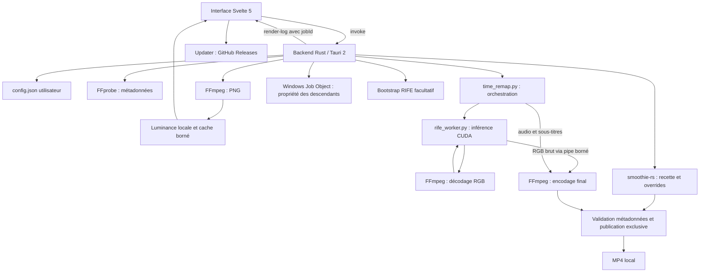

# Cartographie de cia render

Carte du patch finalisée le 1er octobre 2026, version déclarée **1.2.3**. Le dépôt de l'application est `time-remap-ui` ; `time-remap-app` contient l'environnement Python/RIFE local et les médias d'essai. Les binaires, poids de modèle, médias et résultats de compilation sont exclus du Git.

## Architecture

Les pages sont **RENDER**, **INTERPOLATION** et **ABOUT**. Le traitement des médias est local. L'installation facultative RIFE et les mises à jour utilisent le réseau.

## Fichiers et responsabilités

| Fichier | Rôle |
| --- | --- |
| `src/main.js` | Montage de Svelte et polices |
| `src/App.svelte` | Navigation, configuration, import, snapshot du job, progression, aperçus, installation et mises à jour |
| `src/GlowSlider.svelte` | Curseur animé ; animation arrêtée au repos |
| `src-tauri/src/main.rs` | Entrée native |
| `src-tauri/src/lib.rs` | Commandes Tauri, configuration, métadonnées, aperçus, propriété des processus, réservation et publication des sorties |
| `src-tauri/resources/time_remap.py` | Contrats d'entrée, orchestration worker/encodeur, audio, sous-titres, validation et nettoyage |
| `src-tauri/resources/rife_worker.py` | Chargement du modèle sélectionné, décodage borné, inférence et flux RGB |
| `scripts/time_remap_dev.py` | Entrée de développement vers le script embarqué, sans copie indépendante de l'algorithme |
| `src-tauri/resources/bootstrap/bootstrap-rife.ps1` | Installation/adoption du runtime RIFE facultatif |
| `src-tauri/tauri.conf.json` | Fenêtre, ressources, NSIS et updater |
| `scripts/build-update.mjs` | Signature d'un installateur préparé et manifeste de mise à jour |
| `.github/workflows/ci.yml` | Vérifications frontend, Python et Rust sur Windows, avec les ressources suivies par Git |

Le runtime ignoré comprend Smoothie, ses plugins/VapourSynth, FFmpeg et FFprobe. RIFE est un environnement séparé comprenant Python, PyTorch CUDA, Practical-RIFE, le code du modèle et `flownet.pkl`. Le modèle configuré est effectivement transmis au worker.

## Interface et backend

| Domaine | Commandes principales |
| --- | --- |
| Initialisation | `get_runtime_snapshot`, `get_app_version` |
| Configuration | `save_runtime_config`, `save_ui_preferences`, `pick_runtime_path` |
| Import | `open_file_dialog`, `analyze_video` |
| Aperçus | `generate_video_preview_frame`, `generate_video_preview_set`, `cancel_video_previews` |
| Installation | `install_rife_environment` |
| Traitement | `run_time_remap`, `run_smoothie` |
| Contrôle | `pause_render`, `resume_render`, `cancel_render` |
| Ouverture | `open_target_file`, `open_target_folder`, `open_about_link` |

`render-log` porte `{jobId, line}` pour isoler la télémétrie des traitements. `live-log` reste utilisé hors rendu, notamment pendant l'installation ; `install-progress` décrit les étapes du bootstrap. Les événements Tauri de dépôt servent à l'import.

Un job capture source et paramètres avant le lancement. L'historique change la navigation pendant le calcul, sans supprimer le job actif. Le backend réserve un seul job global avant la préparation ; il refuse un second calcul même si le frontend en demande un. Les réponses d'analyse et d'aperçu portent des identifiants de requête pour écarter les réponses obsolètes.

## Parcours INTERPOLATION

1. Résolution des outils, validation des options et réservation du job et du nom de sortie.
2. FFprobe lit la première vraie piste vidéo, sa cadence rationnelle, ses dimensions, rotation, SAR, durée et streams associés.
3. Le worker charge le code et les poids du modèle configuré. FP32 reste le défaut ; FP16 est explicite.
4. FFmpeg décode la piste sélectionnée, avec normalisation VFR vers la cadence moyenne. Une file bornée alimente le modèle.
5. Le modèle conserve la logique RIFE de scènes/images statiques. Les images interpolées passent directement à FFmpeg ; aucun MP4 RIFE intermédiaire ni recherche par glob.
6. FFmpeg encode H.264, par défaut x264/CRF18/medium. NVENC est optionnel. En boost, cadence multipliée et durée conservée ; en slowmo, cadence conservée et durée multipliée, avec chaîne audio `atempo`.
7. L'audio compatible est copié en boost ; les autres cas sont encodés AAC. Les sous-titres texte sont convertis en `mov_text`, avec timestamps étirés en slowmo. Les sous-titres bitmap sont refusés.
8. Les codes retour, comptes de frames, FPS, dimensions, SAR, durée et présence d'audio sont vérifiés. Publication exclusive après validation ; nettoyage limité au répertoire possédé par le job.

Le worker produit **N × facteur** images, en tenant la dernière image pour compléter la fin. L'ancien moteur produisait généralement `(N−1) × facteur + 1` images. Les comparaisons de qualité utilisent seulement les indices communs.

Le profil livré est SDR H.264 8 bits. HDR PQ/HLG est refusé avant le rendu ; une conversion de transfert explicite reste nécessaire. Le backend refuse actuellement les dimensions impaires. L'outil Python autonome peut les compléter par padding.

## Parcours RENDER

Rust transmet la recette configurée, les réglages validés, le chemin LUT configuré et l'encodeur. Les réglages couleur non neutres activent réellement le traitement. Les arguments d'encodage imposent la conservation des dimensions et du SAR de la source ; les changements de vitesse de recette sont ramenés à 1 pour respecter la durée affichée par l'application.

Smoothie écrit dans un répertoire réservé. Une sortie non vide et un code retour nul ne suffisent pas : FPS, dimensions, SAR, durée et audio sont contrôlés avant publication. Le runtime peut annoncer un succès malgré une erreur de filtre ; cette validation détecte notamment une sortie ne contenant que l'audio.

L'auto-render enchaîne Smoothie sur le résultat RIFE avec le snapshot initial des réglages. Si la seconde étape échoue, le résultat RIFE validé reste accessible. L'aperçu final est décodé depuis la sortie réelle.

## Aperçus et processus

Une couverture est chargée à l'import ; les huit aperçus temporels supplémentaires sont demandés au survol. Huit extractions PNG remplacent les anciennes seize invocations FFmpeg ; la luminance est calculée en Rust. Le cache contient au plus quatre ensembles, identifiés par chemin, taille, modification, durée et outil. Les requêtes obsolètes peuvent être annulées ; les aperçus approximatifs répétés pendant le rendu sont supprimés.

Les moteurs sont créés suspendus, associés à un **Windows Job Object** avec terminaison à la fermeture, puis repris. Les gardes possèdent les processus et les fichiers du job. Annulation, fermeture, erreur et abandon arrêtent les descendants avant nettoyage. Pause/reprise contrôlent les processus du groupe. Les logs conservés sont bornés.

## Données et sorties

| Donnée | Emplacement ou propriétaire |
| --- | --- |
| `RuntimeConfig` | `config.json` dans le répertoire de configuration Tauri ; sections RIFE, Smoothie, outils média et UI |
| Écriture de configuration | Sérialisée, fichier temporaire unique et remplacement atomique ; une configuration illisible n'est pas écrasée par les défauts |
| Runtime RIFE installé | Répertoire de données Tauri, `runtimes/rife/` |
| Jobs et aperçus | Mémoire de l'application et gardes natives |
| Temporaires de rendu | Répertoire unique possédé par la réservation |
| Sortie boost | `clip-240fps.mp4` |
| Sortie Smoothie | `clip_render30fps.mp4` |
| Collision | Suffixe `(1)`, `(2)`… ; publication sans écrasement |

## Validation et entretien

Voir [PATCH-QUALITE-PERFORMANCES.md](PATCH-QUALITE-PERFORMANCES.md) pour les tests exécutés, restrictions du runtime et performances mesurées ; [AUDIT-QUALITE-PERFORMANCES.md](AUDIT-QUALITE-PERFORMANCES.md) conserve les constats de la révision initiale.

`App.svelte` et `lib.rs` restent les deux principaux monolithes. Les prochains travaux de maintenance peuvent extraire configuration, jobs, aperçus et modèles de paramètres dans des modules dédiés. Les runtimes ignorés restent nécessaires pour les essais réels et la distribution ; la CI source seule ne certifie pas un installateur complet.
